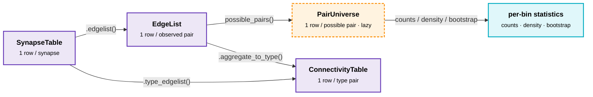

# Cheatsheet: connectivity × space × cell types

A task-oriented reference for the connectomics analyst. Each recipe shows how to
build up a common data object that links **who connects to whom** (connectivity),
**where the cells are** (space), and **what kind of cell they are** (cell types).

If you read nothing else, read the mental model — every recipe is a path through it.

## Mental model: five objects, one universe



Plus one cross-cutting view:

```
  cells(table, scope=...)  →  pl.DataFrame, one row per cell
```

The thing that ties it together is the **cell universe**: the authoritative set of
cells that *exist* for the analysis, including those with zero connections. You
declare it once, with `is_universe=True` on a cell annotation, and every
denominator-bearing object (`cells`, `possible_pairs`, `connection_density`, the
bootstrap) resolves it automatically.

| Object | One row is | Has `.df`? | Use it for |
| --- | --- | --- | --- |
| `SynapseTable` | a synapse | yes (cached) | filtering, spatial features, the raw merged table |
| `EdgeList` | an observed cell→cell pair | yes (cached) | observed connectivity, per-pair weights |
| `ConnectivityTable` | a type→type pair | yes (cached) | type-level matrices, normalization |
| `PairUniverse` | a *possible* cell→cell pair | **no** — `.collect()` | denominators: density, probability, nulls |
| `cells(...)` | a cell | returns a frame | plotting somas, per-cell summaries, "1:1 with the analysis" |

`PairUniverse` deliberately has no `.df`: a 60k-cell universe is 3.6 billion pairs.
You compose filters (spatial pruning especially) and aggregate, *then* collect.

---

## End to end in one block

A complete analysis touching most of the objects above — build, annotate with type
and space, bless the universe, then read out observed connectivity, a type matrix,
the cell table, and a distance-binned connection density with bootstrap CIs.

```python
import polars as pl
import trajan

# 1. Synapses + one cell annotation carrying type, soma position, and the universe.
st = trajan.SynapseTable(
    pl.scan_parquet("synapses.parquet"),
    synapse_position_col="ctr_pt_position",
).add_cell_annotation(
    "cells", pl.read_parquet("cells.parquet"),   # root_id, cell_type, soma_x/y/z
    cell_id_col="root_id", position_col="soma", is_universe=True,
)

# 2. Add soma-to-soma spatial features (soma_rho = lateral distance, etc.).
st = st.add_spatial_features(prefix="soma")

# 3. Restrict to an excitatory→inhibitory analysis (cell-level filters).
st = (
    st.filter(pl.col("cell_type_pre") == "23P")
      .filter(pl.col("cell_type_post").is_in(["BC", "MC"]))
)

# 4. Observed connectivity, three ways.
el      = st.edgelist()                                  # cell→cell pairs + n_syn
matrix  = st.type_edgelist("cell_type_pre").to_dense()   # type × type counts
the_cells = trajan.cells(st, scope="filtered")           # one row per cell, 1:1 with the filters

# 5. Connection density vs. lateral distance, with cell-bootstrap CIs.
density = trajan.bootstrap_over_cells(
    st,
    group_by=["cell_type_post"],
    bin_by={"soma_rho": [0, 50, 100, 200, 500]},
    n_resamples=1000, seed=0,
)   # cell_type_post, soma_rho_bin, k_observed, n_possible, p, p_lo, p_hi
```

Every step after (1) inherits the same universe and the same filters — the cell
table, the density denominator, and the bootstrap all resolve them automatically,
so the four outputs stay mutually consistent. The recipes below unpack each step.

---

## 0. The foundational setup

Almost every recipe starts here. Build a `SynapseTable`, attach a cell annotation
that carries **both** the cell type and the soma position, and bless it as the
universe.

```python
import polars as pl
import trajan

# Synapses: one row per synapse. ctr_pt_position is a packed x/y/z struct.
st = trajan.SynapseTable(
    pl.scan_parquet("synapses.parquet"),
    pre_col="pre_pt_root_id",
    post_col="post_pt_root_id",
    id_col="id",
    synapse_position_col="ctr_pt_position",
)

# One annotation, three roles: cell_type column, soma position, AND the universe.
# cells_df has columns: root_id, cell_type, soma_x, soma_y, soma_z
st = st.add_cell_annotation(
    "cells",
    pl.read_parquet("cells.parquet"),
    cell_id_col="root_id",
    position_col="soma",     # auto-packs soma_x/soma_y/soma_z into a struct
    is_universe=True,        # this is the authoritative cell set
)
```

After this, `.df` exposes `cell_type_pre` / `cell_type_post` and
`soma_pre` / `soma_post` automatically — every cell annotation column `c` becomes
`c_pre` and `c_post`. Check what you've got with:

```python
st.info()   # prints columns, annotations, roles, weights, expressions
```

!!! tip "Position columns"
    `position_col="soma"` auto-packs split `soma_x/_y/_z` columns into a struct.
    If your positions are already a struct, pass its name. For odd layouts,
    pre-pack with `trajan.pack_position(df, "soma", x="...", y="...", z="...")`.

!!! tip "One annotation or many?"
    You *can* split cell types and positions into separate annotations. But the
    universe annotation is the one `cells()` and `possible_pairs()` join siblings
    onto, and per-cell filters only project cleanly off columns that live on the
    universe annotation. Keeping cell type + position + universe on one annotation
    is the path of least surprise. Add more later with `extend_cell_annotation`.

---

## 1. Observed connectivity between cell types

> *"Give me the cell→cell edges among my cells, with their types attached."*

```python
el = st.edgelist()          # EdgeList: one row per observed (pre, post) pair
el.df                        # pre id, post id, n_syn, + cell_type_pre/_post, soma_pre/_post
```

`edgelist()` always produces an `n_syn` weight (synapse count per pair). Cell
annotations are *propagated* (re-registered on the EdgeList, not baked in), so
roles (`position_col`, `is_universe`) and aliases survive — spatial and type
filters still work downstream.

Filter to a population (these are cell-level filters; they classify by side and
later project cleanly onto `cells()` / `possible_pairs()`):

```python
exc_to_inh = (
    st.filter(pl.col("cell_type_pre") == "23P")
      .filter(pl.col("cell_type_post").is_in(["BC", "MC"]))
      .edgelist()
)
```

Carry extra per-pair aggregates through the aggregation:

```python
el = st.edgelist(agg={"mean_size": pl.mean("size"), "total_size": pl.sum("size")})
```

Agglomerate a column into a per-pair **count struct** — one field per value
(categorical) or bin (numeric), plus a `__null__` field. `count_by` gives raw
counts; `fraction_by` gives fractions (each struct sums to 1.0):

```python
el = st.edgelist(count_by="syn_type")           # syn_type = {exc: 7, inh: 2, __null__: 0}
el = st.edgelist(fraction_by="syn_type")         # {exc: 0.78, inh: 0.22, __null__: 0.0}
el = st.edgelist(count_by={"size": [100, 500]})  # numeric → {"<= 100": .., "(100, 500]": .., "> 500": .., __null__: ..}
```

- Categorical columns: pass the bare name(s); distinct values become fields.
- Numeric columns: pass `{name: bin_edges}` (strictly-ascending, ±inf-extended
  so nothing is dropped). A numeric column without bins raises.
- A column may appear in `count_by` *or* `fraction_by`, not both. Combine across
  different columns freely: `count_by="syn_type", fraction_by={"size": [100, 500]}`.
- `fraction_include_null=False` drops the `__null__` field and divides by the
  non-null count instead (value fields then sum to 1.0).

Both `count_by`/`fraction_by` also work on `type_edgelist(...)`.

---

## 2. A type-by-type connectivity matrix

> *"Collapse cells to cell types and give me the type × type synapse counts."*

Two routes to the same place. From synapses directly:

```python
ct = st.type_edgelist("cell_type_pre")   # post defaults to cell_type_post
ct.df                                     # cell_type_pre, cell_type_post, n_syn
ct.to_dense(values="n_syn")               # dense pre × post matrix DataFrame
```

Or promote an existing `EdgeList` (handy when you've already filtered/weighted it):

```python
ct = el.aggregate_to_type(pre="cell_type_pre", post="cell_type_post")
```

Normalize to input/output fractions (the type algebra drops `n_syn` from the
weight list because a fraction isn't summable):

```python
ct_in  = ct.normalize(by="post")    # column-stochastic: fraction of each target's input
ct_out = ct.normalize(by="pre")     # row-stochastic: fraction of each source's output
mat    = ct_in.to_dense(values="fraction", fill_value=0)
```

Other shape-preserving transforms: `.binarize(threshold=0)`, `.log1p()`.

---

## 3. The cell table (per-cell view, 1:1 with the analysis)

> *"One row per cell, with type and position — and only the cells my filters keep."*

`cells()` is the single source of truth for per-cell views. Think of it as *the
universe, decorated*: the universe annotation defines the rows, and you choose the
decorations. `scope` decides *which* cells; it stays 1:1 with your filters.

```python
from trajan import cells

cells(st)                      # the decorated universe — every cell, all annotations (default)
cells(st, scope="filtered")    # universe ∩ cell-level filters
cells(st, scope="observed")    # only cells that actually appear in .df
```

The column set is identical across scopes (universe + joined siblings); only the
row set changes. This is what makes a soma plot trivially match a stats result —
both call `cells()` with the same scope.

Pick which decorations to join with `annotations=`:

```python
cells(st)                          # "all" (default): universe + every sibling annotation
cells(st, annotations=None)        # just the universe annotation's own columns
cells(st, annotations=["types"])   # universe + only the named sibling(s)
```

Add per-cell participation columns with `participation=True` — booleans and
synapse counts describing how each cell appears in the (filtered) observed edges,
overlaid onto *every* universe cell (zero-connection cells get `False` / `0`):

```python
cells(st, participation=True)
# adds: in_pre, in_post (bool), n_syn_out, n_syn_in (synapse counts)

# "presynaptic cells" is just a filter on a column — works with no filter present:
cells(st, participation=True).filter(pl.col("in_pre"))
```

!!! note "Two-sided filters"
    Under `scope="filtered"`, a filter referencing both sides non-decomposably
    (e.g. `cell_type_pre != cell_type_post`) can't project to per-cell semantics —
    it's skipped with a warning but still applies to `.df`. Split it into separate
    single-sided `.filter()` calls for tight projection.

For aggregate per-cell statistics (in/out degree, summed weights, annotations), use
`cell_summary` instead:

```python
from trajan import cell_summary

summary = cell_summary(st)   # one row per cell: n_syn_output, n_syn_input, + annotations
summary = cell_summary(st, pre_agg={"mean_out_size": pl.mean("size")})
```

---

## 4. Add space: distances and spatial features

> *"I want soma-to-soma distance, depth, and radial offset on every pair."*

Declare the position once (step 0), then generate a battery of features. The
vector is `target − center`; the default is pre→post soma.

```python
st = st.add_spatial_features(prefix="soma")
# adds: soma_euclidean, soma_depth_diff, soma_r, soma_theta, soma_phi, soma_rho,
#       soma_dy, soma_pre_depth, soma_post_depth
```

- `soma_euclidean` / `soma_r` — 3-D distance
- `soma_rho` — lateral (in-plane) distance, ignoring depth
- `soma_depth_diff` / `soma_dy` — signed cortical-depth offset
- `soma_theta`, `soma_phi` — spherical angles
- `soma_pre_depth` / `soma_post_depth` — *absolute* signed depth of each soma
  (toggle with `cell_depth=`). Unlike the vector features these don't depend on
  `center`/`target`; `post_depth − pre_depth == depth_diff`.

`depth_axis="y"` means +y is deeper; append `_r` (`"y_r"`) to flip. Call it twice
with different `prefix=`/`center=` for both perspectives, or target the synapse:

```python
st.add_spatial_features(prefix="pre_syn", center="pre", target="syn")
```

For a single custom distance column, `with_distance` skips the per-side naming:

```python
from trajan import with_distance, radial_distance
st = with_distance(st, "d_lateral", radial_distance)   # adds radial_distance(soma_pre, soma_post)
```

**Transform a position struct** through a function, repacking the result as a
new `{x, y, z}` position column. The default `func` is array-based
(`(N,3) → (N,3)`) — the form `standard_transform` and affine maps speak:

```python
from trajan import transform_point
tf = minnie_transform_nm()
st = st.add_expression("soma_um", transform_point("soma", tf.apply))   # (N,3)->(N,3)

# vectorized=True keeps it fully lazy when the transform is expressible in polars:
st = st.add_expression(
    "soma_um",
    transform_point("soma", lambda x, y, z: (x / 1e3, y / 1e3, z / 1e3), vectorized=True),
)
```

Array mode runs as one vectorized `map_batches` call at collect — fast, but
opaque to the optimizer; prefer `vectorized=True` for transforms that are pure
polars. A null (or any-axis-null) point maps to a null output struct in both
modes. `depth_component(col, depth_axis=)` gives a single soma's signed depth.

Spatial filters read the declared `position_col` directly — no feature column
needed:

```python
near = st.filter_by_radial_distance(100)      # ≤100 lateral (depth-free)
far3d = st.filter_by_euclidean_distance(100)  # ≤100 in 3-D (depth included)
box  = st.filter_by_bbox(((xmin, ymin, zmin), (xmax, ymax, zmax)))     # synapse in box
```

These filters exist on `EdgeList` and `PairUniverse` too (where bbox checks *both*
somas).

---

## 5. The possible-pairs universe (the denominator)

> *"For connection probability/density I need the pairs that **could** connect,
> not just the ones that do."*

`possible_pairs` enumerates universe × universe with observed counts overlaid
(`n_syn = 0` for unconnected pairs). It returns a lazy `PairUniverse` — no `.df`,
because the full cross-product is enormous. **Prune before you collect.**

```python
from trajan import possible_pairs

pp = possible_pairs(el)                    # |U|² − |U| lazy rows, n_syn overlaid
pp = pp.filter_by_radial_distance(200)     # lateral pruning is what keeps it tractable
pp = pp.filter(pl.col("cell_type_pre") == "23P")
```

Cell-level filters from the source project onto the cross-product the same way they
do for `cells()`. Synapse-level filters bake into the *observed* counts (via
`.edgelist()`) but don't shrink the universe of possibilities — that's intentional.

Materialize only after reducing:

```python
pp.group_by(["cell_type_pre", "cell_type_post"]).agg(
    (pl.col("n_syn") > 0).sum().alias("k"),
    pl.len().alias("n"),
).collect()

pp.collect()          # full (pruned) frame — warns above ~10M rows
pp.to_edgelist()      # just the observed (n_syn > 0) subset, as an EdgeList
pp.to_pair_frame()    # full cross-product incl. zeros, as a raw DataFrame
```

Draw a random sample of pairs with their connectivity (the **pair-draw**
primitive — see §6 for when to use it). `weights` biases the draw to match an
experimental sampling distribution:

```python
pp.filter_by_radial_distance(200).sample_pairs(500, seed=0)   # uniform, w/ replacement
pp.sample_pairs(80, weights="w", seed=0)   # ∝ a registered per-pair weight expr
# returns sampled rows + a `connected` (n_syn > 0) boolean
```

---

## 6. Connection probability / density per bin

> *"What fraction of possible connections are realized, as a function of distance
> and cell type?"*

These compose `possible_pairs` (denominator) + observed counts (numerator). Pass a
table and the universe is derived for you; pass a pre-pruned `PairUniverse` to reuse
your spatial filtering.

```python
from trajan import connection_density, connection_probability

# bin_by: {col: [edges]} → continuous (pl.cut, col named "{col}_bin");
#         {col: None}     → categorical pass-through
density = connection_density(
    st,
    group_by=["cell_type_pre", "cell_type_post"],
    bin_by={"soma_rho": [0, 50, 100, 200, 500]},
)
# columns: keys..., k_observed, n_possible, sum_<weights>, p
```

`connection_density` and `connection_probability` are the same formula
(`p = k_observed / n_possible`); the names just signal dense vs. sampled
interpretation. The low-level primitive is `counts(pu, bin_by=, group_by=)` — it
takes a `PairUniverse` *only* (handing it observed-only data would collapse every
`p` to ~1).

Confidence intervals — pick the estimator that matches your data:

```python
from trajan import wilson_ci, agresti_coull_ci, bootstrap_over_cells

# Closed-form binomial CI (fine for sparse / sampled data):
connection_probability(st, bin_by={"soma_rho": [0, 100, 200]}, estimator=wilson_ci(0.05))

# Cell-bootstrap percentile CI — the RECOMMENDED method for dense connectomics,
# where pairs sharing a cell co-vary and binomial CIs are overconfident:
bootstrap_over_cells(
    st,
    group_by=["cell_type_pre", "cell_type_post"],
    bin_by={"soma_rho": [0, 50, 100, 200]},
    n_resamples=1000,
    seed=0,
)   # adds p_lo / p_hi from the bootstrap distribution
```

For custom summaries over the resamples, iterate with `cell_bootstrap_iter(...)`.

**Match the resampling unit to how the data was collected.** Dense EM
reconstruction → resample *cells* (`bootstrap_over_cells`), because pairs sharing
a cell co-vary. Paired-recording designs that probe individual pairs → resample
*pairs*; for binary connectivity that is exactly `wilson_ci`, and for weighted /
non-binary draws build on `PairUniverse.sample_pairs` (§5). With a single pre
cell, skip the cell bootstrap and use `wilson_ci`. The
[Connectivity statistics](connectivity-statistics.md) guide covers this in full.

---

## 7. Chained / aliased annotations (stable IDs)

> *"My annotations are keyed on a `cell_id` that survives root-ID changes, not on
> root IDs directly."*

Register an annotation that maps root ID → stable ID, declare the alias, then key
later annotations on it:

```python
st = (
    trajan.SynapseTable(syn)
    .add_cell_annotation("ids", id_map, cell_id_col="root_id",
                         alias_col="cell_id")        # registers a "ids" alias on cell_id
    .add_cell_annotation("types", types_df, cell_id_col="cell_id",
                         join_on_alias="ids",        # join on the stable id, not root id
                         is_universe=True)
)
```

`set_cell_alias(annotation_name, col, alias_name=)` does the same after the fact.
Aliases survive `.edgelist()` and `possible_pairs()`.

---

## 8. Vertex / compartment annotations

> *"My label lives on a mesh vertex (l2 id), not the cell — e.g. axon vs. dendrite."*

```python
st = st.add_vertex_annotation(
    "compartment",
    compart_df,
    vertex_id_col="l2_id",
    pre_vertex_col="pre_l2_id",     # column on the synapse table
    post_vertex_col="post_l2_id",
)
# → compartment_pre / compartment_post on .df
soma_targeting = st.filter(pl.col("compartment_post") == "soma")
```

Synapse-level metadata (sizes, cleft scores, predictions) goes through
`add_synapse_annotation(name, df, position_cols=...)`, joined on `id_col`.

---

## 9. Export to graphs and pandas

```python
from trajan import to_graph, to_dataframe

G = to_graph(st)                              # networkx DiGraph; cell annotations → node attrs
G = to_graph(st, backend="igraph")
A, ids = to_graph(st, backend="csgraph")      # (scipy.sparse.csr_array, cell_ids)
G = to_graph(st, cell_agg={"n_out": pl.len()})  # per-cell aggregates → node attrs

df = to_dataframe(st)    # pandas; struct positions unpacked to _x/_y/_z by default
```

---

## 10. Persistence

Every table round-trips through a DataFolio (annotations as Parquet, filters and
expressions serialized in config):

```python
st.save("my_analysis.folio", overwrite=True)
st2 = trajan.SynapseTable.load("my_analysis.folio")

el.save("edges.folio")
el2 = trajan.EdgeList.load("edges.folio")     # or ConnectivityTable.load(), which dispatches
```

---

## 11. Working with large tables: bind, peek, project

> *"My synapse table is millions of rows. How do I keep notebooks fast and memory
> sane — especially when I make a dozen plots off the same filtered data?"*

**Bind the reduced object once, then reuse it.** Every `.filter()` / `.edgelist()`
returns a *new* table with an empty cache, so re-typing the whole chain in each
cell re-scans the source and re-runs every join and aggregation. Aggregating 8M
synapses for *each* of five plots is the most common avoidable cost. Build the
small object once and let its (cached) `.df` serve every plot:

```python
# ❌ each cell rebuilds the chain from raw synapses
sns.scatterplot(data=st.filter(pl.col("is_pf_pre")).edgelist().df, ...)   # cell A
sns.scatterplot(data=st.filter(pl.col("is_pf_pre")).edgelist().df, ...)   # cell B — recomputes everything

# ✅ bind once; .df is cached on `el`, so later cells are free
el = st.filter(pl.col("is_pf_pre")).edgelist()
sns.scatterplot(data=el.df, ...)   # collects once
sns.scatterplot(data=el.df, ...)   # cache hit
```

The same applies to `cells(participation=True)`: pass the **bound `EdgeList`**, not
the `SynapseTable`, so participation counts don't re-aggregate the synapses each call:

```python
el = st.edgelist()
cells(el, participation=True).filter(pl.col("in_pre"))   # reuses el, no re-aggregation
```

**Peek without materializing.** `st.df.head()` forces a *full* collect of every row
and pins it on the cache just to show a few. Use `preview(n)` — it pushes a
`head(n)` limit into the plan, collects only `n` rows, and caches nothing:

```python
st.preview()      # first 10 rows of the merged table; nothing pinned
el.preview(20)
pu.preview()      # safe peek at a PairUniverse without the full cross-product collect
```

**Release a cache** you no longer need (the merged synapse `.df` can be GBs):

```python
st.clear_cache()   # drops the materialized .df; next .df rebuilds lazily. chainable.
```

**Project to just the columns you need** with `collect(cols)`. It selects *before*
collecting, so Polars' projection pushdown skips materializing — and can prune the
joins for — unused annotation columns. The narrow result is fresh and uncached:

```python
el.collect(["soma_depth_pre", "soma_depth_post", "size", "pre_post_distance"])
```

!!! note "When does `collect(cols)` actually help?"
    Mainly at **synapse scale** (millions of rows × wide) or on a **full unfiltered
    edgelist**. The *filtered* edgelists and `cells()` frames you usually plot are
    small (≤10⁵ rows) — there the cached `.df` is already cheap and projecting buys
    little. The bigger levers for those are **binding** (above) and `preview()`.

**Drop to lazy polars for ad-hoc queries.** When the result is small (a count, a
group-by) don't go through `.df` — it collects and pins the whole wide frame.
`.lazy` exposes the uncollected plan; `.select` / `.group_by` are pass-throughs
that return native polars objects (they reshape columns, so they leave trajan —
projection/predicate pushdown then materializes only what you ask for). Available
on every tier (`SynapseTable`, `ConnectivityTable`, `EdgeList`, `PairUniverse`):

```python
st.filter(pl.col("is_pf_pre")).group_by("syn_type").len().collect()  # never builds .df
st.select(["pss", "size"]).collect()                                  # narrow, lazy
st.lazy.join(other_lf, on="id").group_by(...).agg(...).collect()      # mix with raw polars
len(st)          # row count — cache-aware, cheap (st.count() is the same)
```

Rule of thumb: ends in a small result → `.lazy.…​.collect()` or `collect(cols=)`;
genuinely need the full wide frame repeatedly → `.df` (then `clear_cache()`).

---

## Quick reference

**Build & annotate** (`SynapseTable`)
: `add_cell_annotation(name, df, cell_id_col, position_col=, is_universe=, join_on_alias=, alias_col=)`
  · `extend_cell_annotation(name, df, on=, position_col=, is_universe=)`
  · `add_synapse_annotation(name, df, syn_id_col=, position_cols=)`
  · `add_vertex_annotation(name, df, vertex_id_col, pre_vertex_col=, post_vertex_col=)`
  · `set_cell_alias(annotation_name, col, alias_name=)`
  · `add_expression(name, expr)` · `add_weight(col)` · `add_weight_transform(name, source_col, transform="log1p")`
  · `add_spatial_features(prefix=, center=, target=, depth_axis=, cell_depth=)`

**Filter** (returns a new table)
: `filter(expr)` · `filter_by_ids(pre_ids=, post_ids=)` · `filter_by_radial_distance(d)` / `filter_by_euclidean_distance(d)`
  · `filter_by_bbox(bbox)` · `filter_by_min_synapses(n, weight_col=)` · `filter_to_annotated(name, pre=, post=)`

**Reshape**
: `st.edgelist(agg=, count_by=, fraction_by=, fraction_include_null=)` → `EdgeList` · `st.type_edgelist(pre_col, post_col=, count_by=, fraction_by=)` → `ConnectivityTable`
  · `el.aggregate_to_type(pre=, post=)` · `ct.normalize(by=, total_col=)` · `binarize()` · `log1p()` · `to_dense(values=)`

**Cell & pair views**
: `cells(table, annotations="all"|[...]|None, scope="universe"|"filtered"|"observed", participation=, universe=, strict=)`
  · `cell_summary(st, pre_agg=, post_agg=)` *(observed cells only; richer aggregates)*
  · `possible_pairs(table, universe=, include_self=)` → `PairUniverse`
  · `PairUniverse`: `.filter()` `.filter_by_radial_distance()` `.filter_by_euclidean_distance()` `.filter_by_bbox()` `.filter_by_ids()` `.sample_pairs()` `.group_by().agg()` `.collect()` `.to_edgelist()` `.to_pair_frame()`

**Statistics** (accept `PairUniverse` | `SynapseTable` | `EdgeList`)
: `counts(pu, bin_by=, group_by=)` *(PairUniverse only)*
  · `connection_probability(...)` / `connection_density(...)` `(estimator=, universe=, include_self=)`
  · `wilson_ci(alpha)` · `agresti_coull_ci(alpha)`
  · `bootstrap_over_cells(..., n_resamples=, alpha=, seed=)` · `cell_bootstrap_iter(...)`
  · `with_distance(table, name, distance_fn, annotation=)`

**Spatial helpers**
: `pack_position(df, col, x=, y=, z=)` · `unpack_position` · `pack_all_positions` · `unpack_all_positions`
  · `euclidean_distance(a, b)` · `radial_distance(a, b)` · `depth_component(col, depth_axis=)`
  · `transform_point(col, func, vectorized=False)` *(repack a position struct through a transform)*

**Export**
: `to_graph(st, edge_agg=, cell_agg=, backend="networkx"|"igraph"|"csgraph")` · `to_dataframe(st, unpack_positions=)`

**Inspect & materialize**
: `st.info()` · `st.df` / `el.df` *(cached full)* · `preview(n=10)` *(uncached peek)* · `collect(cols=)` *(narrow projection)*
  · `.lazy` *(uncollected plan)* · `.select(...)` / `.group_by(...)` *(→ native polars, lazy)* · `len(tbl)` / `.count()`
  · `clear_cache()` *(release `.df`)* · `st.cell_annotations[name]` · `st.weights` · `st.filter_sides`

**`bin_by` recipes**
: `{"d_rho": [0, 50, 100, 200]}` continuous → `d_rho_bin` · `{"cell_type_post": None}` categorical
  · `{"d_rho": [...], "d_y": [...]}` joint 2-D grid · mixing continuous + categorical is fine
